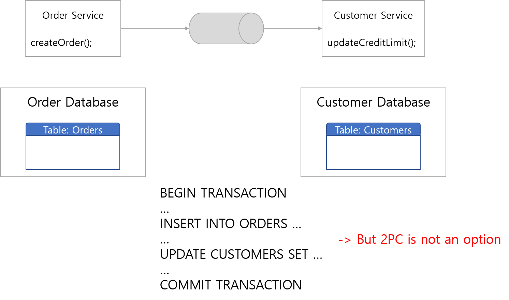

# 1. 개요
Microservice Architecture(MSA)는 서비스간 느슨한 결합을 통해 더 빠르게 개발하고 더 빠르게 배포하여 end user의 요구사항을 보다 유연하게 제공할 수 있는 아키텍처 스타일이다.
다만, MSA의 일반적인 원칙은 Database per Service이다.
각각의 Microservice는 각각의 Database를 가지도록 설계되기 때문에 여러개의 서비스 사이에서 데이터의 정합성을 보장하는 일은 쉬운일이 아니다.

## 1.1 분산 데이터 처리 이슈

